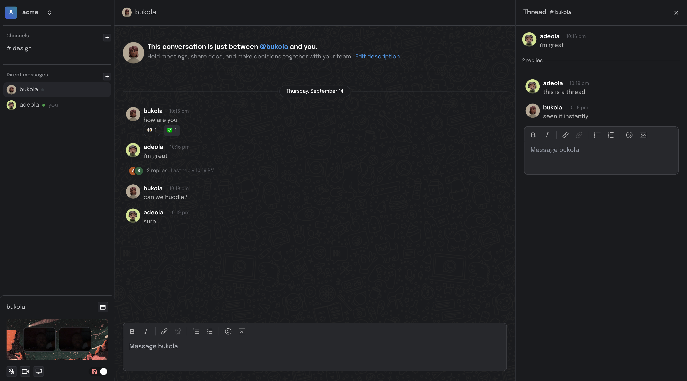

# Slack Clone API

## Table of Contents

- [Introduction](#introduction)
- [Features](#features)
- [Getting Started](#getting-started)
  - [Prerequisites](#prerequisites)
  - [Installation](#installation)
- [Usage](#usage)
  - [User Registration](#user-registration)
  - [Creating Channels](#creating-channels)
  - [Sending Messages](#sending-messages)
  - [Message Replies (Threads)](#message-replies-threads)
  - [Huddle with Other Users](#huddle-with-other-users)
- [Advanced Usage](#advanced-usage)
  - [Customizing Notifications](#customizing-notifications)
  - [Integrating with External Tools](#integrating-with-external-tools)
- [FAQ](#faq)
- [Contributing](#contributing)
- [License](#license)

## Introduction

Slack clone is a powerful team collaboration platform that allows you to communicate and collaborate with your team members in real-time. Whether you're working remotely or in the same office, our application provides a seamless and efficient way to stay connected.



## Features

- Real-time chat and messaging
- Channel-based communication
- Direct messaging between users
- File and media sharing
- Customizable notifications
- **Message Replies (Threads)**
  - Start threads to reply to specific messages in a conversation.
  - Keep discussions organized and focused.
- **Huddle with Other Users**
  - Create private huddles for group discussions.
  - Collaborate with select team members in a secure environment.

## Getting Started

### Prerequisites

Before you begin, ensure you have met the following requirements:

- Node.js (version X.X.X)
- MongoDB (version X.X.X)
- Git (optional)

### Installation

1. Clone the repository:

   ```bash
   git clone https://github.com/your-repo/your-slack-like-app.git
   ```

2. Change to the project directory:

   ```bash
   cd your-slack-like-app
   ```

3. Install dependencies:

   ```bash
   npm install
   ```

4. Set up environment variables:

   Create a `.env` file in the root directory of the project and add the necessary environment variables, including your database connection details and any API keys.

   ```plaintext
   DB_URI=mongodb://localhost:27017/your-database-name
   API_KEY=your-api-key
   # Add other environment variables here
   ```

5. Start the application:

   ```bash
   npm start
   ```

6. Access the application in your web browser at `http://localhost:3000`.

## Usage

### User Registration

1. Visit the application's URL.

2. Click on the "Sign Up" or "Register" button to create a new user account.

3. Fill out the registration form with your details.

4. Once registered, you can log in with your credentials.

### Creating Channels

1. After logging in, you can create a new channel by clicking on the "Create Channel" button.

2. Choose a name and description for your channel.

3. Invite team members to join the channel.

### Sending Messages

1. To send a message in a channel, click on the channel's name in the left sidebar.

2. Type your message in the input field at the bottom of the chat window and press Enter to send.

3. You can also send direct messages to other users by clicking on their name in the user list.

### Message Replies (Threads)

1. To start a thread in response to a specific message:

   - Hover over the message you want to reply to.

   - Click on the "Reply" or "Start Thread" button.

   - Type your reply in the thread and send it.

2. Keep discussions organized by using threads to respond to messages.

### Huddle with Other Users

1. To create a private huddle:

   - Click on the "Huddle" button in the sidebar.

   - Select the users you want to include in the huddle.

   - Start your private conversation.

2. Huddles provide a secure environment for group discussions with select team members.

## Advanced Usage

### Customizing Notifications

You can customize notification settings for channels and direct messages. To do this:

1. Click on the channel or user you want to customize notifications for.

2. Click on the settings icon (usually represented as a gear or cog).

3. Adjust the notification preferences according to your needs.

### Integrating with External Tools

Your Slack-Like Application Name supports integrations with external tools and services. To set up integrations:

1. Navigate to the "Integrations" section in the application settings.

2. Follow the instructions for integrating with specific tools (e.g., Google Calendar, GitHub).

## FAQ

**Q:** How can I reset my password?

**A:** You can reset your password by clicking on the "Forgot Password" link on the login page. Follow the instructions sent to your registered email address.

**Q:** Is my data secure?

**A:** We take data security seriously. All communication is encrypted, and user data is stored securely. For more details, please refer to our [security documentation](security.md).

## Contributing

We welcome contributions from the community. To contribute to the project, please follow our [contributing guidelines](CONTRIBUTING.md).

## License

This project is licensed under the [MIT License](LICENSE).

---

This updated README now includes information about the new features "Message Replies (Threads)" and "Huddle with Other Users." You can further customize it to provide more details, examples, and screenshots specific to your application.